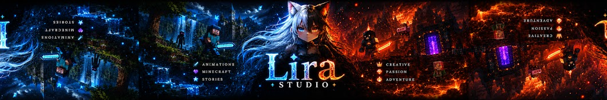

<h1 align="center">
  🎬 LiraStudioYT - Mineimator Portfolio 🎬
</h1>

  

<h3 align="center">
  Personal portfolio website created for a Minecraft animator and YouTube creator.
</h3>

  Showcasing Mine-imator animations, creative projects, skills and digital work.

## 🌐 Live Demo

🔗 Website:

# 📖 About The Project

**LiraStudioYT-Mineimator-Portfolio** is a modern portfolio website designed to present my work as a Minecraft animator and content creator.

The website focuses on:
- 🎬 Mine-imator animations
- 🎥 YouTube projects
- 🖼️ Visual presentation
- ✨ Modern user experience
- 📱 Responsive design

# ✨ Features

✅ Modern and responsive UI  
✅ Animated sections and smooth transitions  
✅ Project showcase  
✅ Custom components  
✅ Optimized performance with Next.js  
✅ Clean and scalable code structure  
✅ Mobile-friendly design  

# 🛠️ Technologies

The project was built using:

