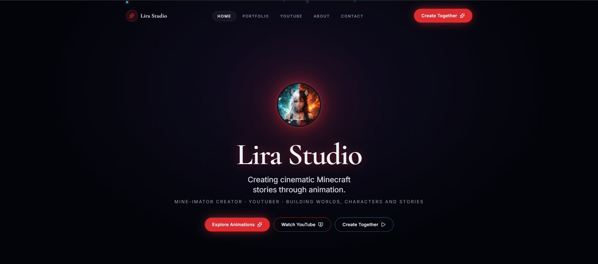
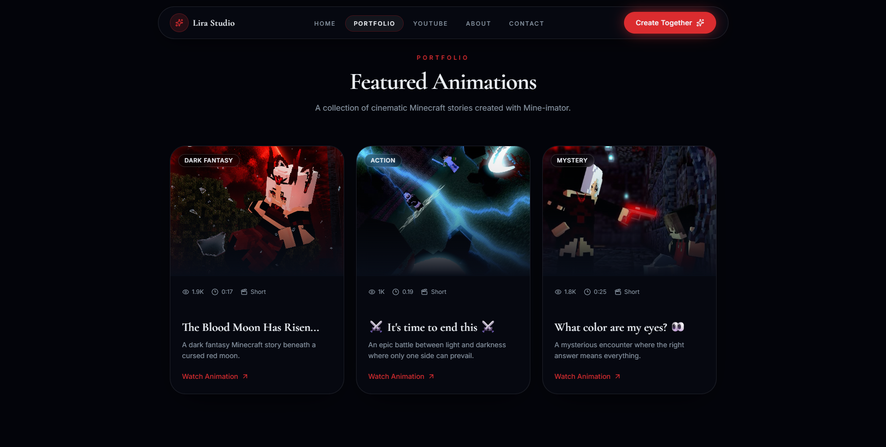
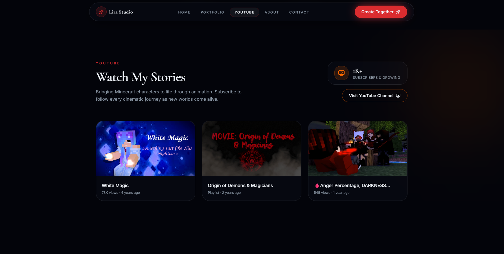
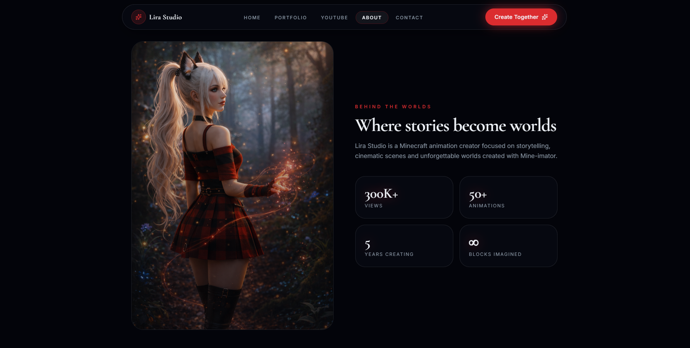
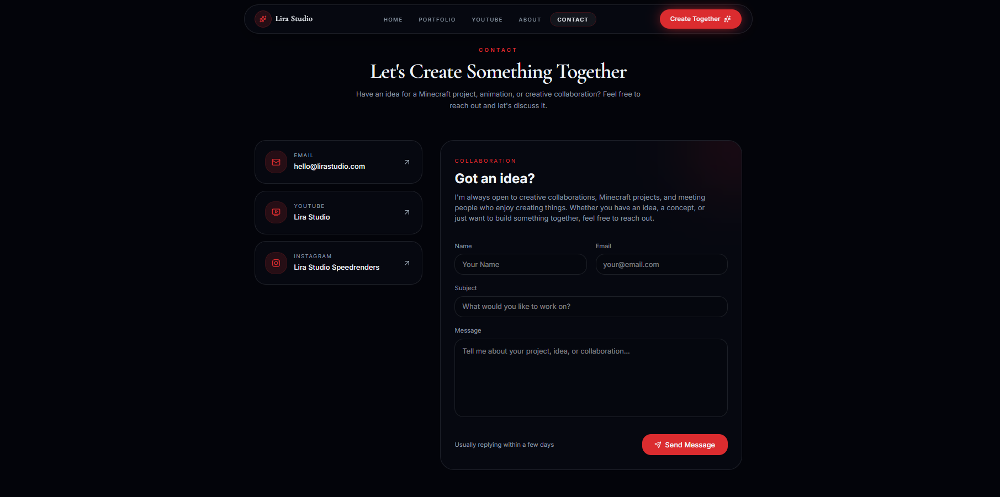
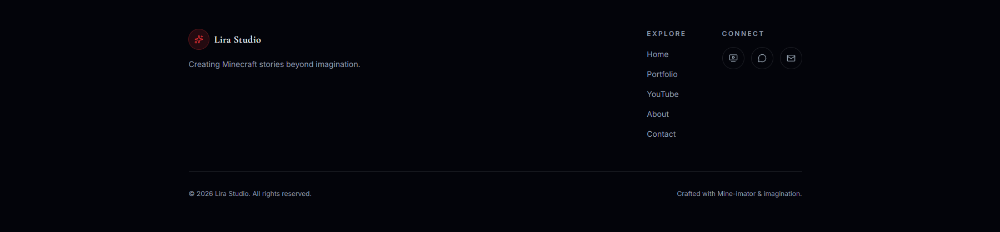

<h1 align="center">
  🎬 LiraStudioYT Mine-imator Portfolio 🎬
</h1>

  

<h3 align="center">
  A personal portfolio website created for a Minecraft Animator and YouTube Content Creator.
</h3>

 Showcasing Mine-imator animations, creative projects, skills, and digital artwork.

## 🌐 Live Demo

🔗 Visit the website:

# 📖 About The Project

**LiraStudioYT-Mineimator-Portfolio** is a modern portfolio website designed to present my work as a Minecraft animator and content creator.

The website focuses on:
- 🎬 Mine-imator animations
- 🎥 YouTube projects
- 🖼️ Visual presentation
- ✨ Smooth and modern user experience
- 📱 Responsive design

# ✨ Features

✅ Modern and responsive UI  
✅ Animated sections and smooth transitions  
✅ Project showcase  
✅ Custom components  
✅ Optimized performance with Next.js  
✅ Clean and scalable code structure  
✅ Mobile-friendly design  

# 🛠️ Technologies

The project was built using:

 

<h1 align="center">
  📸 Screenshots 📸
</h1>

  ✦ ──────────────────── ✦

  ✦ ──────────────────── ✦

  ✦ ──────────────────── ✦

  ✦ ──────────────────── ✦

  ✦ ──────────────────── ✦

 

## 👤 Creator

<h3>Created by Lira Studio</h3>

Minecraft animator and YouTube creator focused on creating cinematic Mine-imator animations.

### Links

🎬 YouTube  
https://www.youtube.com/@Lira_StudioYT/

🐙 GitHub  
https://github.com/Tygrys11

📸 Instagram  
https://www.instagram.com/lirastudiospeedrenders/

  

---

  Thanks for visiting my portfolio! 🎬✨

